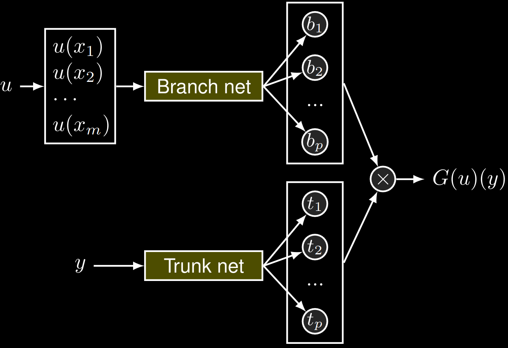

# DeepONets in JAX & Equinox
Simple implementation of Deep Operator Networks (DeepONets) in the JAX deep learning framework together with Equinox.

This is a simple tutorial that uses the aligned antiderivative dataset of the
tutorial of the [DeepXDE
library](https://deepxde.readthedocs.io/en/latest/demos/operator/antiderivative_aligned.html).

📺 [Here](https://youtu.be/cngSwV6MDYshttps://youtu.be/cngSwV6MDYs) you can find
a video with detailed explanations to code along.

💽 Want more Machine Learning & Simulation? Check out [this
repo](https://github.com/Ceyron/machine-learning-and-simulation) with more codes
and handwritten notes.

### About DeepONets

Deep Operator Networks are neural operators that do not return the full output
field of the operator but allow to query it at arbitrary coordinates (both in
space and time, if applicable). As such, they are different from, e.g., [Fourier
Neural Operators](https://github.com/Ceyron/FNO-in-JAX).

To do so, the input field and the query coordinate are mapped to a latent
representation via a branch and a trunk net, respectively. Ultimately, the
output at the query coordinate is found as the inner product of the two latent vectors.

Implementing DeepONets in JAX & Equinox is fantastic because we design them
single batch (one input field & one query coordinate). Then we can use JAX'
automatic vectorization (via `jax.vmap`) to get more evaluation formats for
free.